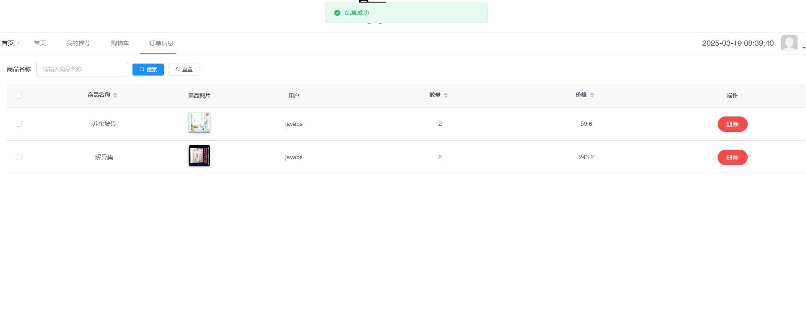

# 1.项目介绍
- 系统角色：管理员、普通用户
- 功能模块：用户管理、角色管理、商品管理、商品类型管理、出入库记录、订单管理、商品推荐算法等
- 技术选型：SpringBoot，Vue等
- 测试环境：idea2024，jdk1.8，mysql5.7，maven3，node14.16.1，redis7
# 2.项目部署
## 2.1 后端部署
- 创建数据库，导入sql文件
- idea打开目录shop-service，根据本地数据库环境修改src/main/resources/application.yml 40-42行；com/ruoyi/system/service/impl/TTypeServiceImpl.java 69-71行
- 启动redis7，根据本地redis环境，修改src/main/resources/application.yml 73-79行
- 启动项目ruoyi-admin/src/main/java/com/ruoyi/RuoYiApplication.java
## 2.2 管理web
- idea（安装vue.js插件）或者webstorm、vscode等ide工具打开项目shop-web(命令行操作也可以）
- 进入终端，输入 npminstall安装依赖（下载失败自行配置阿里的镜像加速）
- 启动项目 npm run dev
- 打开终端的地址，输入账号密码：管理员（admin、123456）,普通用户自己注册即可2.3
 ## 2.3 协同过滤算法说明
- 演示协同过滤：新注册的号，没有任何操作（冷启动）直接看推荐，全推。
- 加购物车或下单操作后，再打开推荐，基于物品的协同过滤推荐算法是基于物品之间的相似性来进行推荐的。
- 主要思想是找到和当前用户喜欢的物品相似的其他物品，然后将这些物品推荐给当前用户。
# 3.项目部分截图

# 4.获取方式
[戳我查看](https://gitee.com/aven999/mall)
